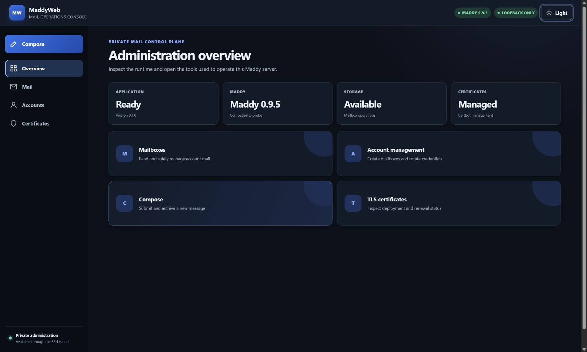

# MaddyWeb

MaddyWeb is a local administration interface for Maddy Mail Server. It separates the unprivileged Web
process from the restricted root helper; the two communicate only through
`/run/maddyweb/helper.sock`. The Web service always listens on
`127.0.0.1:8787`, and remote administration must use SSH local port forwarding.

The project's primary constraint is "fail closed": when the version, CLI fingerprint, configuration structure, Docker
topology, or helper health does not match a tested contract, write operations are disabled instead of guessing compatibility.

[](docs/assets/maddyweb-overview.png)

<p align="center"><em>MaddyWeb administration overview - private mail operations through a loopback-only console.</em></p>

## Default Web listener

MaddyWeb's default and production listener is **`127.0.0.1:8787`**. If
`server.listen` is omitted, the application uses this value; every supplied
configuration template also pins it explicitly. Port `8787` is the MaddyWeb
HTTP interface, while port `1587` is the separate Maddy management Submission
endpoint and is not a Web port.

Remote access should forward the default listener over SSH:

```console
ssh -N -L 127.0.0.1:8787:127.0.0.1:8787 admin@mail.example.net
```

Both ends of the forwarding rule are intentionally loopback-only. Do not bind
the service to a public address or publish it through Docker or Nginx.

## Browser architecture

The administration console is a static single-page application: one fixed HTML shell, one local stylesheet,
and one local vanilla JavaScript application. The Python service does not render UI pages or interpolate
backend values into HTML. Browser state is loaded through the versioned `/api/v1` JSON API, while raw mail,
attachments, and sanitized message HTML remain separate streaming or document responses. Sanitized message
HTML is displayed only in an empty-sandbox iframe with a dedicated restrictive CSP.

The browser fetches its process-bound CSRF token from `/api/v1/session`, serializes every mutation globally,
and accepts the replacement token only from the response header. Mutations are never retried automatically.
No frontend dependency, build tool, CDN, remote font, or external image is required.

## Supported scope

- CPython 3.14, including standard builds and free-threaded `3.14t`.
- Exact Maddy versions: `0.8.2`, `0.9.0`, `0.9.1`, `0.9.2`, `0.9.3`,
  `0.9.4`, and `0.9.5`.
- Native Maddy on Linux/systemd, or an existing Docker Maddy container with a fixed name. MaddyWeb
  itself is always installed as a native venv and systemd service, not run in a container.
- The only Web entry point is `127.0.0.1:8787`; public listening and reverse-proxy exposure are unsupported.

Maddy `0.8.2` does not have a `verify-config` subcommand. MaddyWeb never invokes it for that version
because the old release sends unknown subcommands through the implicit server-run path. Any change affecting listening endpoints on
`0.8.2` requires explicit acceptance of a brief restart outage.

## Process boundaries

| Component | Identity and entry point | Permission scope |
| --- | --- | --- |
| Web | `maddyweb` user, `127.0.0.1:8787` | UI, sessions, and validation; cannot see the Docker socket |
| helper | root, Unix socket `0660 root:maddyweb` | Fixed allow-listed Maddy, SMTP, certificate, and systemd operations |
| Maddy | Native service or existing Docker container | Mail data, credentials, mailboxes, messages, and TLS files |

Passwords pass briefly only through stdin for a required invocation or through the local Unix socket; they never enter command lines,
environment variables, logs, or audit records. The operational scripts in this repository do not accept password arguments and do not edit or reload
Nginx; the certificate workflow may perform only the read-only `nginx -t` configuration check. Before every certificate write, the helper
reparses the allow-listed lineage and invokes Certbot only when the authenticator is `webroot` and the installer is
`none`, with no lineage hooks. The `nginx`, `standalone`, and `manual`
authenticators and DNS plugins all degrade to read-only. Direct invocations always use an empty CLI configuration and
`--no-directory-hooks`, and require the system and root XDG default `cli.ini` files to be absent, preventing
ConfigArgParse from merging default configuration or inheriting arbitrary hooks.
A supported webroot must be a canonical, root-owned directory below `/var/www` or `/srv/www` that
group and other users cannot write. The managed systemd drop-in grants write access only to exact roots
explicitly listed in `certificates.webroot_roots`. The default empty list grants no webroot write access, so even when certificate
status is readable, Certbot write controls remain read-only. Writes additionally require the renewal file and actual runtime
Certbot to be in the audited `1.0.0`-`5.7.0` range; unknown options and higher versions are always read-only.

When certificate management is enabled, the installer transactionally manages the Certbot deploy hook
`/etc/letsencrypt/renewal-hooks/deploy/maddyweb`. It accepts only the exact lineage corresponding to an allow-listed name,
reuses the existing atomic certificate deployment workflow, reloads Maddy, and reads the fingerprint back;
it never issues certificates, forces renewal, or modifies or reloads Nginx. Because a Certbot directory hook is global,
other certificates under the same canonical live root that are not allow-listed safely become no-ops, avoiding interference with their
renewal; malformed or escaping paths still fail with a nonzero status. An unmanaged hook with the same name is never overwritten or deleted.

The Web interface can inspect or disable an existing renewal timer, but it does not re-enable an external Certbot timer. An external unit
may scan lineages outside the allow-list or inherit drop-ins and hooks, so a single invocation's fixed argv cannot constrain it.
Enable fails closed until a dedicated managed renewal service is implemented. The page still displays certificates, fingerprints, and
timer status; unsafe lineages do not display dry-run or renewal write controls.

Docker SMTP does not publish a host port. The helper always runs
`docker exec -i <configured-container> /usr/bin/nc 127.0.0.1 1587` inside the container's own
network namespace to connect to the loopback Submission endpoint.

Docker `/data` supports both bind mounts and exclusive local named volumes. Named-volume
configuration editing neither reads nor guesses Docker daemon internal paths. Dry-run is read-only; apply uses a one-shot
helper with no network to atomically replace the fixed `/data/maddy.conf` in the same directory, with the full container
ID, content hash, owner and mode, and failure rollback gates protecting the transaction.

## Development

```console
uv sync --python 3.14
uv run pytest -q
uv run ruff check .
```

Command entry points:

```console
uv run python -m maddyweb --help
uv run python -m maddyweb serve --config deploy/examples/config.native.toml
uv run python -m maddyweb helper --config deploy/examples/config.native.toml
```

The example configurations contain production-safe defaults, but refer to real `/etc/maddy`,
`/etc/letsencrypt`, and `/run` paths. Do not treat them as demo environments that work without prepared dependencies.
All three templates explicitly set `server.request_body_timeout_seconds = 15`; the deployment validator
accepts only 1..120 seconds, and a timeout aborts a slow or stalled request-body read.

## Deployment entry point

Every change script defaults to dry-run. Production `--apply` additionally requires:

1. An explicit `--host` value that must equal the current `hostname`;
2. A validated local wheel, full Git commit, SHA-256, and offline wheelhouse;
3. A one-time root approval generated after the operator types a host-bound confirmation phrase in a TTY;
4. Use of the approval within ten minutes, with consumption before any change.

Start with the [deployment guide](docs/deployment.md), and use
the [operations runbook](docs/runbook.md) for routine work, see
the [compatibility matrix](docs/compatibility.md) for version differences, and read [SECURITY.md](SECURITY.md) for the security model.

The security release gates cover MaddyWeb's production Python dependencies, source, root helper, secrets,
configuration, and parsers. The official Maddy binary or image remains a separate upstream component and continues to be scanned against its exact digest
and publicly reported, but its vulnerabilities do not block a MaddyWeb release; the version and CLI fingerprints and seven-version functional matrix remain
mandatory. For the detailed scope and current informational findings, see
[MaddyWeb security gates and Maddy upstream findings](docs/security-gates.md).

Common configuration templates:

- Native Linux: `deploy/examples/config.native.toml`
- systemd WSL: `deploy/examples/config.wsl.toml`
- Docker management mode: `docker/config.toml`

Paths in production configuration must be conservative, normalized absolute Linux paths; the installer uses them to generate a systemd
drop-in whose dynamic entries include only the Web temporary directory and the Maddy or certificate paths actually required by the current mode.
Changes to managed drop-ins and hooks participate in installation rollback together with the release symlink and units. See the deployment guide for the complete
path rules and directory prerequisites.

## SSH access

Verify the server host key independently, then establish local forwarding from the administrator workstation:

```console
ssh -o ExitOnForwardFailure=yes -o StrictHostKeyChecking=yes \
  -N -L 127.0.0.1:8787:127.0.0.1:8787 admin@mail.example.net
```

Then access only `http://127.0.0.1:8787/`. Do not add a `0.0.0.0:8787` listener,
Docker port publishing, an Nginx location, or a public firewall rule.

## Compatibility verification

The WSL container matrix uses immutable image digests from `tests/integration/maddy-image-lock.json`.
Image pulls are denied by default; only an explicit `-AllowImagePull` permits pulling those locked
references.

```powershell
./tests/integration/maddy-wsl-matrix.ps1 `
  -Distro Ubuntu `
  -Mode Container
```

For all seven versions, the matrix exercises real CLI fingerprint detection, account and password changes, APPENDLIMIT,
rejection of SMTP AUTH with a wrong password, local SMTP delivery with the correct password, and mailbox and message
add/list/dump/move/remove operations, plus certificate deploy/status/fault-injection rollback. Fixtures use
an internal Docker network, one-shot volumes, and random accounts, and are unconditionally cleaned up on exit.

A successful `GET /healthz` response contains exactly `status`, `version`, `maddy_version`,
`maddy_write_enabled`, `storage_available`, `certbot_available`,
and `certificate_management_enabled`. It returns HTTP 200 with `status="ok"` only when the helper is reachable, the Maddy version and CLI contract are
supported, and storage is available. Otherwise it returns HTTP 503 with a degraded status.
