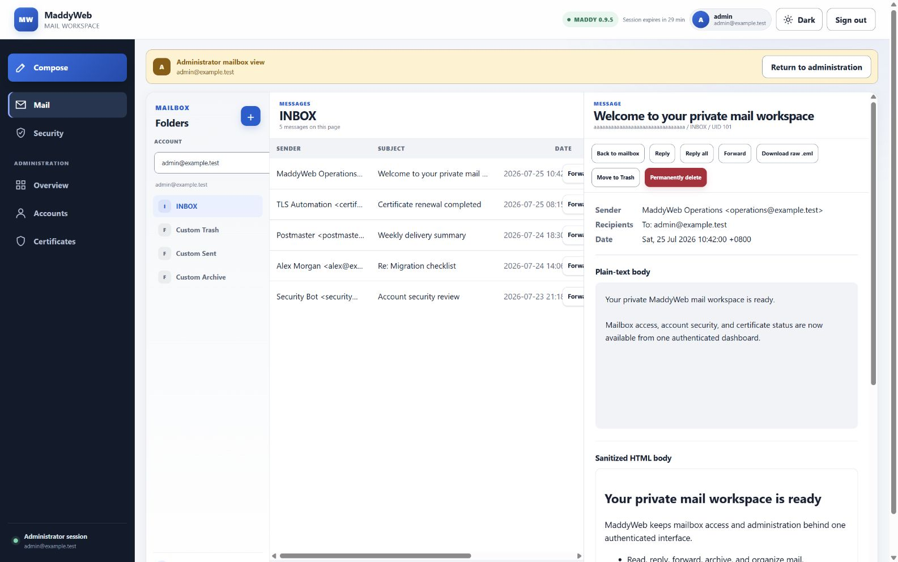

# MaddyWeb

MaddyWeb is an authenticated mail client and administration interface for
Maddy Mail Server. It separates the unprivileged Web process from the
restricted root helper; the two communicate only through
`/run/maddyweb/helper.sock`. The application always listens on
`127.0.0.1:8787`. Remote access uses either the reviewed Cloudflare-only Nginx
edge or an optional SSH local tunnel; the application itself never binds a
public socket.

The project's primary constraint is "fail closed": when the version, CLI fingerprint, configuration structure, Docker
topology, or helper health does not match a tested contract, write operations are disabled instead of guessing compatibility.

[](docs/assets/maddyweb-overview.png)

<p align="center"><em>An authenticated Thunderbird-style mailbox workspace with administration tools close at hand.</em></p>

## Default Web listener

MaddyWeb's default and production listener is **`127.0.0.1:8787`**. If
`server.listen` is omitted, the application uses this value; every supplied
configuration template also pins it explicitly. Port `8787` is the MaddyWeb
HTTP interface, while port `1587` is the separate Maddy management Submission
endpoint and is not a Web port.

The reviewed public layout is Cloudflare, a host Nginx virtual host, and this
loopback listener. Nginx accepts only pinned Cloudflare source ranges,
terminates HTTPS, overwrites the trusted proxy headers, and connects to
`127.0.0.1:8787`. An SSH-only deployment may instead forward the listener:

```console
ssh -N -L 127.0.0.1:8787:127.0.0.1:8787 admin@mail.example.net
```

Both ends of the forwarding rule are intentionally loopback-only. Do not bind
the service to a public address or publish port 8787 through Docker. Do not put
it behind an arbitrary reverse proxy; use only the reviewed public-edge
templates and checks in [docs/public-edge.md](docs/public-edge.md).

## Browser architecture

The administration console is a static single-page application: one fixed HTML shell, one local stylesheet,
and one local vanilla JavaScript application. The Python service does not render UI pages or interpolate
backend values into HTML. Browser state is loaded through the versioned `/api/v1` JSON API, while raw mail,
attachments, and sanitized message HTML remain separate streaming or document responses. Sanitized message
HTML is displayed only in an empty-sandbox iframe with a dedicated restrictive CSP.

The login shell and authenticated application use separate static bundles.
The browser obtains a process-bound CSRF token from `/api/v1/auth/csrf`,
serializes every mutation globally, and accepts the replacement token only
from the response header. Mutations are never retried after an ambiguous
failure. When the server explicitly requires fresh identity verification,
the browser repeats the protected operation once only after a successful
Passkey or password-and-TOTP step-up. No frontend dependency, build tool,
CDN, remote font, or external image is required.

The Mail workspace also provides a merged All Mail view, user-created IMAP
folders, single and bounded bulk moves, and ordered filing rules with nested
AND, OR, and NOT conditions. New-mail filing uses Maddy's `imap_filter`
command through a separate private service; an unavailable rule bridge leaves
normal INBOX delivery intact. See
[Mail organization and filing rules](docs/mail-organization.md) for behavior,
bounds, and deployment details.

## Unified mailbox identity

There is no separate Web password. A user signs in with the full Maddy mailbox
address or its local name, that mailbox's current Maddy password, and a Google
Authenticator compatible TOTP code. Before authentication, the browser can load only the
login page, its small local assets, and the authentication flow. Every mail,
account, certificate, application asset, and business API route requires an
active session. Public Nginx never exposes `/healthz`.

After the first verified sign-in, a mailbox can register a Passkey and use
Windows Hello, macOS Touch ID, iOS Face ID, a synced platform Passkey, or a
security key for later sign-ins. Passkeys require user verification and are
bound to the deployment's exact HTTPS origin and relying-party ID. Passkey
sign-in is discoverable: the browser or authenticator presents its account
chooser, so the login page does not request an email address first. Password
and TOTP login remains available as a recovery path.

An administrator is also a real Maddy mailbox. Only the root-only
`maddyweb auth-role` command can assign its `admin` role; the Web interface
cannot elevate a mailbox. Ordinary users can access only their own Mail,
Compose, and Security workspace. Administrators can manage accounts,
certificates, and other mailboxes, but every send still requires the current
password of the selected sender mailbox.

Accounts created in MaddyWeb receive a unique TOTP secret and ten one-time
recovery codes, shown once to the administrator for secure handoff. An account
created with the Maddy CLI is forced through TOTP enrollment after its first
successful mailbox-password check. See
[Authentication and identity operations](docs/authentication.md) for
bootstrap, recovery, session, and external CLI identity rules.

An active browser session expires after 72 hours without user activity and
always expires after 30 days. The Security workspace lists active sessions
and lets a user remotely revoke another browser. Password, TOTP, account,
certificate, and permanent-message-deletion operations still require identity
verification completed within the preceding five minutes.

## Supported scope

- CPython 3.14, including standard builds and free-threaded `3.14t`.
- Exact Maddy versions: `0.8.2`, `0.9.0`, `0.9.1`, `0.9.2`, `0.9.3`,
  `0.9.4`, and `0.9.5`.
- Native Maddy on Linux/systemd, or an existing Docker Maddy container with a fixed name. MaddyWeb
  itself is always installed as a native venv and systemd service, not run in a container.
- The application entry point is always `127.0.0.1:8787`; public HTTPS is
  supported only through the reviewed Cloudflare-only Nginx edge.

Maddy `0.8.2` does not have a `verify-config` subcommand. MaddyWeb never invokes it for that version
because the old release sends unknown subcommands through the implicit server-run path. Any change affecting listening endpoints on
`0.8.2` requires explicit acceptance of a brief restart outage.

## Process boundaries

| Component | Identity and entry point | Permission scope |
| --- | --- | --- |
| Web | `maddyweb` user, `127.0.0.1:8787` | UI, sessions, and validation; cannot see the Docker socket |
| helper | root, Unix socket `0660 root:maddyweb` | Fixed allow-listed Maddy, SMTP, certificate, and systemd operations |
| delivery filter | `maddyweb-filter` user, private TCP `18787` | Reads immutable rule snapshots; cannot read authentication or mail storage |
| Maddy | Native service or existing Docker container | Mail data, credentials, mailboxes, messages, and TLS files |

Passwords pass briefly only through stdin for a required invocation or through the local Unix socket; they never enter command lines,
environment variables, logs, or audit records. The core application installer
and mail-certificate helper do not accept password arguments, edit Nginx
configuration, or reload Nginx; that helper may perform only the read-only
`nginx -t` configuration check. The public edge is a separate reviewed
operator workflow: it installs only its managed virtual-host assets, validates
the owning Nginx configuration, and reloads that existing owner. Its dedicated
Web-certificate renewal unit repeats validation and reloads only the same
owner after renewal. Before every mail-certificate write, the helper
reparses the allow-listed lineage and invokes Certbot only when the authenticator is `webroot` and the installer is
`none`, with no lineage hooks. The `nginx`, `standalone`, and `manual`
authenticators and DNS plugins all degrade to read-only. Direct invocations always use an empty CLI configuration and
`--no-directory-hooks`, and require the system and root XDG default `cli.ini` files to be absent, preventing
ConfigArgParse from merging default configuration or inheriting arbitrary hooks.
A supported webroot must be a canonical, root-owned directory below `/var/www` or `/srv/www` that
group and other users cannot write. The managed systemd drop-in grants write access only to exact roots
explicitly listed in `certificates.webroot_roots`. The default empty list grants no webroot write access, so even when certificate
status is readable, Certbot write controls remain read-only. Writes additionally require the renewal file and actual runtime
Certbot to be in the audited `1.0.0`-`5.7.0` range; unknown options and higher versions are always read-only.

When certificate management is enabled, the installer transactionally manages the Certbot deploy hook
`/etc/letsencrypt/renewal-hooks/deploy/maddyweb`. It accepts only the exact lineage corresponding to an allow-listed name,
reuses the existing atomic certificate deployment workflow, reloads Maddy, and reads the fingerprint back;
it never issues certificates, forces renewal, or modifies or reloads Nginx. Because a Certbot directory hook is global,
other certificates under the same canonical live root that are not allow-listed safely become no-ops, avoiding interference with their
renewal; malformed or escaping paths still fail with a nonzero status. An unmanaged hook with the same name is never overwritten or deleted.

The Web interface can inspect or disable an existing renewal timer, but it does not re-enable an external Certbot timer. An external unit
may scan lineages outside the allow-list or inherit drop-ins and hooks, so a single invocation's fixed argv cannot constrain it.
Enable fails closed until a dedicated managed renewal service is implemented. The page still displays certificates, fingerprints, and
timer status; unsafe lineages do not display dry-run or renewal write controls.

Docker SMTP never uses a Docker port publication. Before every send, the
helper uses only the fixed local Docker socket to inspect the configured name,
requires a running unpaused container with the configured network scope and
safe port metadata, validates the exact IPv4 listener in both container and
host socket tables, and pins the resulting full container ID. Only then does
it run `docker --host=unix:///var/run/docker.sock exec -i <validated-id> /usr/bin/nc 127.0.0.1 1587`
to connect to the authenticated loopback
Submission endpoint. The default
`maddy.docker_submission_scope = "container"` requires an isolated container
network namespace and leaves no host listener. Existing host-network Maddy
containers require the explicit `"host-loopback"` scope; that mode permits
exactly one host listener at `127.0.0.1:1587` and rejects wildcard, IPv6, and
duplicate listeners.

Docker `/data` supports both bind mounts and exclusive local named volumes. Named-volume
configuration editing neither reads nor guesses Docker daemon internal paths. Dry-run is read-only; apply uses a one-shot
helper with no network to atomically replace the fixed `/data/maddy.conf` in the same directory, with the full container
ID, content hash, owner and mode, and failure rollback gates protecting the transaction.

## Development

```console
uv sync --python 3.14
uv run pytest -q
uv run ruff check .
```

On an isolated WSL Docker host with the locked Maddy 0.8.2 image already
available and host port 1587 free, run the real host-network Submission gate:

```console
sudo bash tests/integration/test-host-network-submission.sh \
  "$(pwd)" "$(pwd)/.venv/bin/python"
```

Command entry points:

```console
uv run python -m maddyweb --help
uv run python -m maddyweb serve --config deploy/examples/config.native.toml
uv run python -m maddyweb helper --config deploy/examples/config.native.toml
```

The example configurations contain production-safe defaults, but refer to real `/etc/maddy`,
`/etc/letsencrypt`, and `/run` paths. Do not treat them as demo environments that work without prepared dependencies.
All three templates explicitly set `server.request_body_timeout_seconds = 15`; the deployment validator
accepts only 1..120 seconds, and a timeout aborts a slow or stalled request-body read.

## Deployment entry point

Every change script defaults to dry-run. Production `--apply` additionally requires:

1. An explicit `--host` value that must equal the current `hostname`;
2. A validated local wheel, full Git commit, SHA-256, and offline wheelhouse;
3. A one-time root approval generated after the operator types a host-bound confirmation phrase in a TTY;
4. Use of the approval within ten minutes, with consumption before any change.

Start with the [deployment guide](docs/deployment.md), and use
the [operations runbook](docs/runbook.md) for routine work. Read
[Authentication and identity operations](docs/authentication.md) before
creating or importing accounts, use the
[Cloudflare public-edge runbook](docs/public-edge.md) for public HTTPS, see
[mail organization and filing rules](docs/mail-organization.md) for folders and
delivery-time filtering, see
the [compatibility matrix](docs/compatibility.md) for version differences, and
read [SECURITY.md](SECURITY.md) for the security model.

The security release gates cover MaddyWeb's production Python dependencies, source, root helper, secrets,
configuration, and parsers. The official Maddy binary or image remains a separate upstream component and continues to be scanned against its exact digest
and publicly reported, but its vulnerabilities do not block a MaddyWeb release; the version and CLI fingerprints and seven-version functional matrix remain
mandatory. For the detailed scope and current informational findings, see
[MaddyWeb security gates and Maddy upstream findings](docs/security-gates.md).

Common configuration templates:

- Native Linux: `deploy/examples/config.native.toml`
- systemd WSL: `deploy/examples/config.wsl.toml`
- Docker management mode: `docker/config.toml`

Paths in production configuration must be conservative, normalized absolute Linux paths; the installer uses them to generate a systemd
drop-in whose dynamic entries include only the Web temporary directory and the Maddy or certificate paths actually required by the current mode.
Changes to managed drop-ins and hooks participate in installation rollback together with the release symlink and units. See the deployment guide for the complete
path rules and directory prerequisites.

## Optional SSH-only access

For a deployment that does not enable the public edge, verify the server host
key independently, then establish local forwarding from the administrator
workstation:

```console
ssh -o ExitOnForwardFailure=yes -o StrictHostKeyChecking=yes \
  -N -L 127.0.0.1:8787:127.0.0.1:8787 admin@mail.example.net
```

Then access only `http://localhost:8787/`; the `localhost` origin is required
for the Secure, `__Host-` authentication cookies. Authentication remains
mandatory through the tunnel. Do not add a `0.0.0.0:8787` listener, Docker
port publishing, or a public firewall rule. For Internet access, use the
reviewed public edge rather than improvising a proxy.

## Compatibility verification

The WSL container matrix uses immutable image digests from `tests/integration/maddy-image-lock.json`.
Image pulls are denied by default; only an explicit `-AllowImagePull` permits pulling those locked
references.

```powershell
./tests/integration/maddy-wsl-matrix.ps1 `
  -Distro Ubuntu `
  -Mode Container
```

For all seven versions, the matrix exercises real CLI fingerprint detection, account and password changes, APPENDLIMIT,
rejection of SMTP AUTH with a wrong password, local SMTP delivery with the correct password, and mailbox and message
add/list/dump/move/remove operations, plus certificate deploy/status/fault-injection rollback. Fixtures use
an internal Docker network, one-shot volumes, and random accounts, and are unconditionally cleaned up on exit.

A successful `GET /healthz` response contains exactly `status`, `version`, `maddy_version`,
`maddy_write_enabled`, `storage_available`, `certbot_available`,
and `certificate_management_enabled`. It returns HTTP 200 with `status="ok"` only when the helper is reachable, the Maddy version and CLI contract are
supported, and storage is available. Otherwise it returns HTTP 503 with a degraded status.
